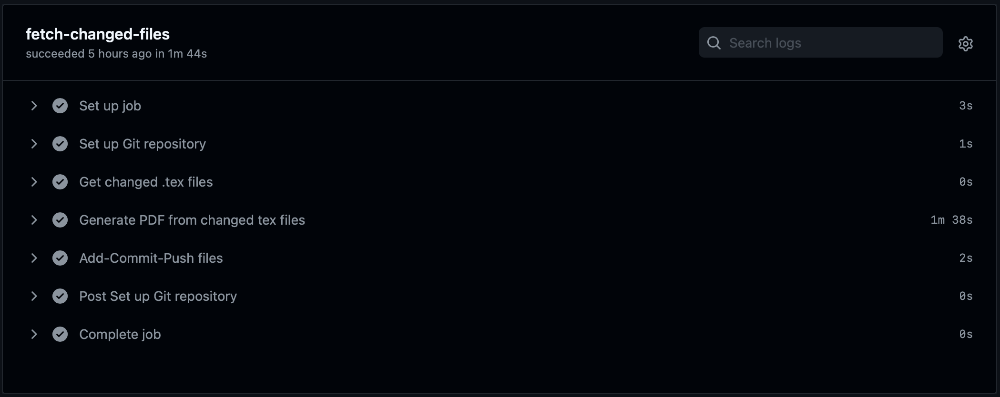

# Resume Ops with GitHub Actions :rocket:
 
## What :thinking:
:sparkles: Build your resume with LaTeX, leverage version control of git to track changes, and perform CI/CD with GtiHub Actions. :sparkles:

## Why :raised_eyebrow:
### Why use git?
Do I even need to explain this? :unamused: It's a mess when you have to keep numerous versions of resumes for different purposes—academic and industry—tailored for multiple stakeholders across disciplines and sectors. So it make sense to have a version control for your resume. :chart_with_upwards_trend:

### Why docker? :whale:
LaTeX can be quite heavy to carry around on a local environment. I know there are online alternatives, like Overleaf, but they have their own limitations. Signing in on new devices (public ones esp), accounts geting lost with changing emails (especially when leaving uni or workplace), paid access for collaborating, and having a reliable internet connection all the time (even for editing docs) make this whole resume-making exercise cumbersome. And let's not forget the amount of control you get with a your favourite local IDE (VSCode :heart:). Additionally, setting up LaTeX on a new system can be a nightmare. You have to take care of versions, OS, packages, fonts... so many things. :person_fencing:

Docker containerises LaTeX and lets you develop locally without having to deal with all the configurations and dependencies. :lotus_position: You can execute a container on your host from a variety of opensource LaTeX images, and start writing and compiling LaTeX immediately. :man_dancing:

### Why GitHub Actions? :confused:
Let's say you don't have LaTeX, or VS Code, or a running Docker container with LaTeX inside, or even this repository cloned on your desktop. However, what you do have is an internet connection and such a remote repo on GitHub. Now, you are in a university library without your laptop sipping coffee when you get to know there's a job fair today. :flushed: You know you have to get several copies (and versions) of your resume quickly. However, the resume versions you already have on the repo are not updated, or are not tailored to the employers visiting. What should you do? :persevere: You can't just start installing LaTeX with all the peculiar configurations, fonts and colours on a library computer, or even your friends' laptops. There's simply no time to install this heavy package, let alone troubleshoot potential errors. :disappointed: You also can't build the docker image there since it will take a lot of space (which these devices may not have), fast internet, and a lot of time. :sob: Here's what you should be able to do. :point_up:

 Sign in to your Github account :white_check_mark:, go to your repo :file_folder:, edit the latex files (assume only light editing like moving and adding sections, editing text content, etc.), and just commit the changes! :rocket: LaTeX should automatically be able to run and compile in a cloud instance somewhere on GitHub servers and get you your precious resumes :'). This is possible with **GitHub Actions** :eye::lips::eye:

 GitHub Actions provides you with CI/CD support to do such tasks easily. Just define a YAML file and you're done—GitHub will automatically run the workflow jobs you defined in the YAML file. :gear:


## So what does it exactly do? :monocle_face:
- Contains the lucid `moderncv` themed reusable tex code :relieved:
- Allows tracking commit history of your resume :hourglass:—useful when you want to revert back to a previous version of your resume 
- Produces PDF files from `.tex` files right on this repository :golfing: always available for download—can house multiple concurrent versions of your resume (one-pager, two-pager, developer, research, etc.)
- Identifies only the changed `.tex` files on every `git push` and compiles them :dart: thus saving overhead and track history effectively 
- **TODO** :wrench:: Uploads the resumes (PDF) to a GDrive folder 

## Run
1. First, fork and clone the repo :octocat:
2. Dive straight to creating your resume! :swimmer: You can use your favourite editor locally. We use [moderncv](https://github.com/moderncv/moderncv) LaTeX package for creating lucid resumes. You can follow their documentation [here](http://mirrors.ctan.org/macros/latex/contrib/moderncv/manual/moderncv_userguide.pdf).

3. Test the output locally by compiling. :cowboy_hat_face: There are two ways of doing this:
    - Install TeX Live distribution yourself. :nerd_face: If you use VSCode, [LaTeX Workshop](https://marketplace.visualstudio.com/items?itemName=James-Yu.latex-workshop) extension is recommended. Follow their [guide](https://github.com/James-Yu/LaTeX-Workshop/wiki/Install) to install all requirements. This is tedious way, but not impossible. 
    - Use docker! :sunglasses: This repo uses the docker image from [blang/latex-docker](https://github.com/blang/latex-docker) to compile tex files and generate PDFs in the GitHub Actions workflow.
        ```
        cd resume-ops-latex
        ./latexdockercmd.sh latexmk -outdir=./resumes -pdf sample.tex
        ```
    [LaTeX Workshop](https://marketplace.visualstudio.com/items?itemName=James-Yu.latex-workshop) can also be used inside a docker environment with VSCode's [Remote – Container](https://marketplace.visualstudio.com/items?itemName=ms-vscode-remote.remote-containers) extension, as mentioned the [wiki](https://github.com/James-Yu/LaTeX-Workshop/wiki/Install#using-docker). 
4. Add, commit, push! :golf:
    ```
    git add .
    git commit -m "Update resume"
    git push
    ```
:warning: **Note**: 
- For all subsequent times when you try to make changes, ALWAYS RUN `git pull` before making any commits. This is because the GitHub Actions workflow compiles the `tex` files and then add-commit-pushes the generated PDFs to the repository's file system. Essentially, this means a change was made on the remote repository and that your local repository is behind by 1 commit. Making a pull beforehand would ensure there are no conflicts. Hence, your ideal set of `git` commands should be:
    ```
    git pull
    git add .
    git commit -m "Update resume"
    git push   
    ```
- In order to avoid duplication, `.gitignore` attempts to remove any PDFs in the root folder of the repo because our workflow is also generating PDFs at `./resumes`. This can be changed according to the user's discretion.

## Workflow :gear:
Our YAML file `.github/workflows/run_ci.yml` does the following things in order each time we push:
1. Checks out (copies) the repository on GitHub's remote workspace.
2. Gets a list of all modified `.tex` files by comparing the most recent commit with the previous commit<sup>[1](#myfootnote1)</sup>. 
3. Builds a docker image and executes `latexmk` commands inside a container ([blang/latex-docker](https://github.com/blang/latex-docker)) to compile each `.tex` file obtained from above; stores PDFs inside `./resumes/` folder.
4. Add, commit, push using [`git-auto-commit-action`](https://github.com/stefanzweifel/git-auto-commit-action) to actually persist the changes (new PDFs) on the remote repository's file system.

It takes approximately 2 minutes to run the complete workflow for one push.



## Acknowledgements
- Docker image to compile my LaTeX files: <https://github.com/blang/latex-docker>
- Inspired from: <https://ljvmiranda921.github.io/notebook/2018/04/23/postmortem-shift-to-docker/>
- git-auto-commit-action: [stefanzweifel/git-auto-commit-action
](https://github.com/stefanzweifel/git-auto-commit-action)

---

<a name="myfootnote1">1</a>: TeX files checked for changes are supposed to be present only in the root directory of the repo, not in any subfolder.